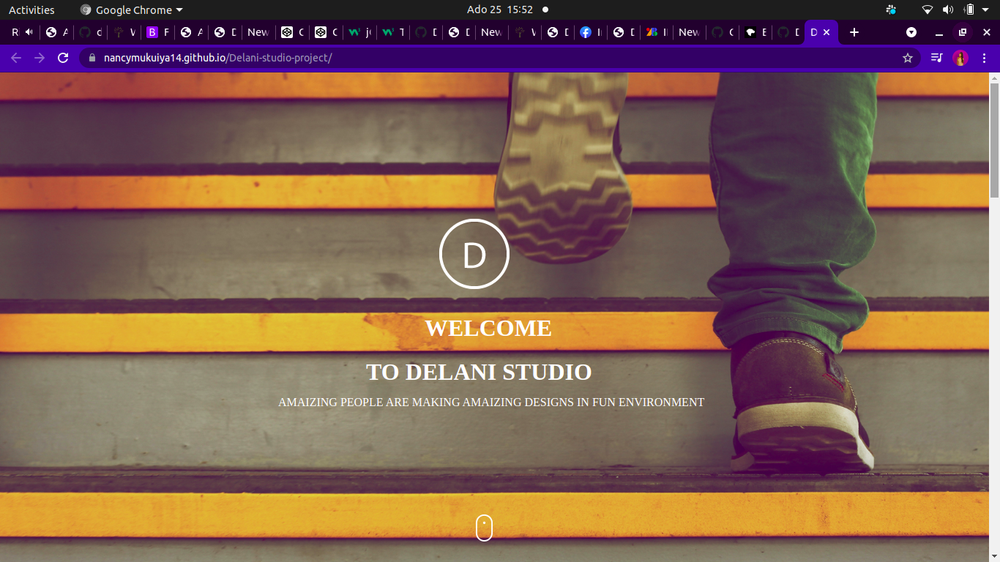
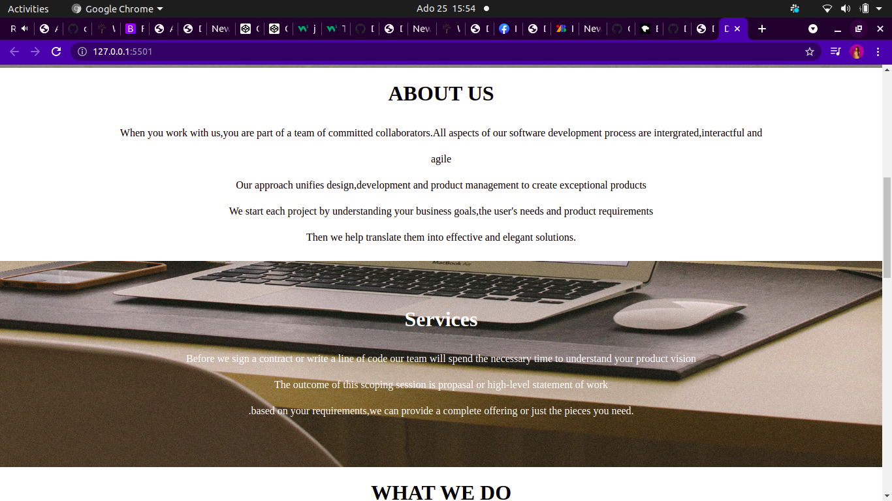
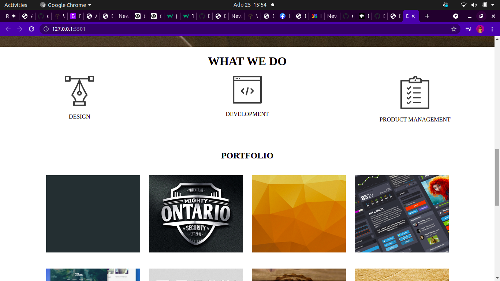
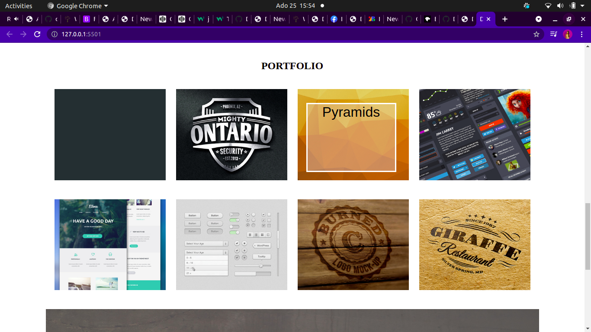
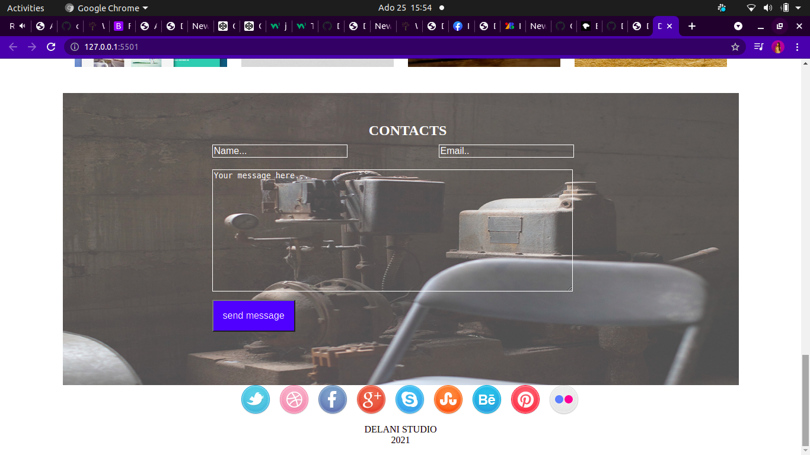

## DELANI STUDIO.
## Created by Nancy Kigotho.
## Description.
* This is the landing page of delani studio.
* Delani studio creates exceptional product by using the design development and product management approach.
## Instructions.
* This landing page entails the about section,services,portfolio and the contact us section.
* To see what we do click on each icon to see the description.
* To see the projects name hover on the images of the projects.
* To send a message fill in the fields and submit.
## Technologies Used.
* HTML.
* CSS.
* Bootstrap
* Javascript.
* Jquery.
## Contact Information.
* if you have any questions about the project please contact me via nancykigotho14@gmail.com.
or call 0705814086.
## Requirements.
* Github.
* Git.
* web browser.
## live link.

## BDD
Thankfully i have no bugs in this project.

## Images.

## Licence.
https://choosealicense.com/licenses/mit/